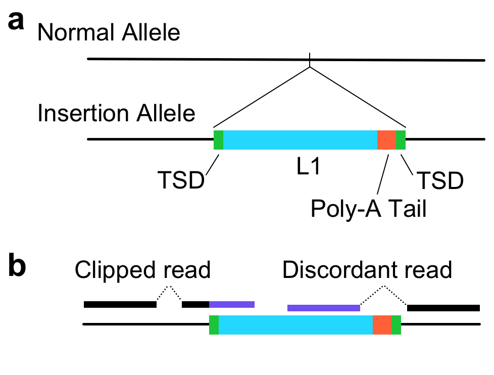
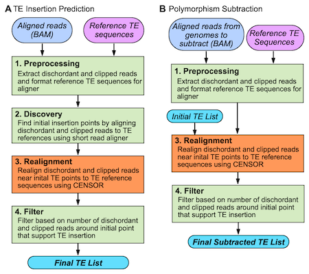

# TEdetective



*Figure 1: Schematic representation of transposable element insertions.*

```````
```````



*Figure 2: TE-Detective approach and modules.*

## Requirements
 * [NCBI blast](https://blast.ncbi.nlm.nih.gov/Blast.cgi?CMD=Web&PAGE_TYPE=BlastDocs&DOC_TYPE=Download)
 * [Censor](https://www.girinst.org/downloads/software/censor/)
 * [BWA](https://github.com/lh3/bwa)
 * Python Packages
     *  numpy
     *  pysam
     *  biopython

## Installation
Clone and install with pip:

````
    git clone https://github.com/edwardslab-wustl/TE-detective.git
    cd TE-detective
    pip install .
````
## Docker Image

   [TE-Detective Docker image](https://hub.docker.com/r/edwardslab/te-detective)
````
	Be sure the following are add to your PATH:
		/opt/conda/bin
		/usr/local/bwa/
		/usr/local/blast-2.2.26/bin
		/usr/local/utils/

	Please set the environmental variable:
		BLASTDIR=/usr/local/blast-2.2.26/bin
````


## Usage

### Input files

````
    1. BAM file should preferably be prepared using following alignment command:
	bwa mem -M -Y -R $RG_LINE ref.fa test_1.fq test_2.fq | samtools view -b -S - > test_ref.bam

    2. Reference sequence of repeat elements:
	Reference sequence of repeat elements can be obtained from Repbase(https://www.girinst.org/server/RepBase/index.php) or other resources.

````

### Test example

````
    cd example_data
    TE_detective preprocess -bam test_sim.bam -ref ref_fofn
    TE_detective discover -bam test_sim.bam -ref ref_fofn
    TE_detective nadiscover -bam test_sim.bam -ref ref_fofn -pat -drd 5 ( adds Poly A/T information to initial prediction) 
    TE_detective analyze -bam test_sim.bam -ref ref_fofn -inp initial_predictions.txt
    TE_detective cluster2d -bam test_sim.bam -ref ref_fofn
    TE_detective filter -ofa final_results -bed rmsk_ucsc_mm10.bed
````

### CEU-Trio use case example.

	1. Insertion prediction in child (NA12878).

		cd $MASTER_DIR/NA12878/
		TE_detective preprocess -bam $MASTER_DIR/NA12878/NA12878_hg19_sorted.bam -ref ref_fofn
		TE_detective discover -bam $MASTER_DIR/NA12878/NA12878_hg19_sorted.bam -ref ref_fofn -rdl 100 -isz 383 ( this step will generate initial_predictions.txt )
		TE_detective nadiscover -bam $MASTER_DIR/NA12878/NA12878_hg19_sorted.bam -ref ref_fofn -rdl 100 -isz 383 -pat ( this step will add Poly A/T information and will generate initial_predictions_noalign.txt ) 
		cp initial_predictions_noalign.txt initial_predictions_NA12878.txt
		TE_detective analyze -bam $MASTER_DIR/NA12878/NA12878_hg19_sorted.bam -ref ref_fofn -inp initial_predictions_NA12878.txt -rdl 100 -isz 383
		cp final_result final_result_NA12878.txt

	2. Insertion prediction in one parent (NA12891).

		cd $MASTER_DIR/NA12891/
		TE_detective preprocess -bam $MASTER_DIR/NA12891/NA12891_hg19_sorted.bam -ref ref_fofn
		TE_detective discover -bam $MASTER_DIR/NA12891/NA12891_hg19_sorted.bam -ref ref_fofn -rdl 100 -isz 439 ( this step will generate initial_predictions.txt )
		TE_detective nadiscover -bam $MASTER_DIR/NA12878/NA12891_hg19_sorted.bam -ref ref_fofn -rdl 100 -isz 439 -pat ( this step will generate initial_predictions_noalign.txt )
		cp initial_predictions_noalign.txt initial_predictions_NA12891.txt
		TE_detective analyze -bam $MASTER_DIR/NA12891/NA12891_hg19_sorted.bam -ref ref_fofn -inp initial_predictions_NA12891.txt -rdl 100 -isz 439
		cp final_result final_result_NA12891.txt

	3. Insertion prediction in other parent (NA12892).

		cd $MASTER_DIR/NA12892/
		TE_detective preprocess -bam $MASTER_DIR/NA12892/NA12892_hg19_sorted.bam -ref ref_fofn
		TE_detective discover -bam $MASTER_DIR/NA12892/NA12892_hg19_sorted.bam -ref ref_fofn -rdl 100 -isz 439 ( this step will generate initial_predictions.txt )
		TE_detective nadiscover -bam $MASTER_DIR/NA12878/NA12892_hg19_sorted.bam -ref ref_fofn -rdl 100 -isz 439 -pat ( this step will generate initial_predictions_noalign.txt )
		cp initial_predictions_noalign.txt initial_predictions_NA12892.txt
		TE_detective analyze -bam $MASTER_DIR/NA12892/NA12892_hg19_sorted.bam -ref ref_fofn -inp initial_predictions_NA12892.txt -rdl 100 -isz 439
		cp final_result final_result_NA12892.txt

	4. Polymorphic insertion prediciton in child:
	
		mkdir $MASTER_DIR/polymorph
		cd $MASTER_DIR/polymorph	
		TE_detective analyze -bam $MASTER_DIR/NA12891/NA12891_hg19_sorted.bam -ref ref_fofn -inp $MASTER_DIR/NA12878/initial_predictions_NA12878.txt -rdl 100 -isz 439
		cp final_result final_result_NA12878_NA12891.txt
		TE_detective analyze -bam $MASTER_DIR/NA12892/NA12892_hg19_sorted.bam -ref ref_fofn -inp $MASTER_DIR/NA12878/initial_predictions_NA12878.txt -rdl 100 -isz 439
		cp final_result final_result_NA12878_NA12892.txt

	5. Aplly filter on final_result_NA12878.txt, final_result_NA12891.txt, final_result_NA12892.txt, final_result_NA12878_NA12891.txt and final_result_NA12878_NA12892.txt. After applying filter, a new insertion in child (NA12878) would be those which are found in final_result_NA12878.txt but not in final_result_NA12878_NA12891.txt or final_result_NA12878_NA12892.txt.


## License information
[Censor](http://www.girinst.org/censor/index.php) is distributed under the GPL license.  See details in [Kohany et. al. Bioinformatics 2006](https://bmcbioinformatics.biomedcentral.com/articles/10.1186/1471-2105-7-474).

[NCBI Blast](https://blast.ncbi.nlm.nih.gov/Blast.cgi?CMD=Web&PAGE_TYPE=BlastDocs&DOC_TYPE=Download) is freely available to the public for use as a "United States Government Work".  See details [here](https://www.ncbi.nlm.nih.gov/IEB/ToolBox/CPP_DOC/lxr/source/scripts/projects/blast/LICENSE).

### Parameters

````

1. Preprocess:

	This module processes the input files (indexed BAM file and indexed fasta file) and create input files for next steps. 

	-bam  : Input indexed bam file (aligned with bwa -mem).
	-ref  : File of file name of TE reference fasta file (please refer to example data for file format) . Please provide file name with absolute path.
	-cll  : minimum length of clipped reads to be extracted. (default=25)

2. Discover:
	
	This module uses output from preprocessing step and  makes initial list of candidate insertions. 	

	-bam  : Input indexed bam file (aligned with bwa -mem).
	-ref  : File of file name of TE reference fasta file (please refer to example data for file format). Please provide file name with absolute path.
	-isz  : Insert size estimate ( = mean_insert_size + 2 * insert_size_standard_deviation - read_length). Use picard to calculate these values.
	-rdl  : Average read length of bam file (can be estimated using picard). (default=150)
	-drd  : Minimum number of total supporting reads for calling an insertion. (default=10)
	-cct  : A region with coverage more than this will be ignored from initial prediction. (default=200)
	-ccl  : Minimum length of clipped read to be analyzed. (default=25)
	-mpq  : Minimum mapping quality of a read. (default=30)
	-mpqu : Value of a mapping quality which is used by uniqness testing algorithm (used for clipped reads). This is value of MAPQ in sction of 3.3 of document. (default=1)

3. Analyze ( This is Realignment step from figure 2):

	Detailed analysis of initial list of candidate insertions from discover step.

	Usages:
	1. For transposable element insertion prediction withing a bam file, use same bam file using which initial prediction list was generated.
	2. For polymorhic substracrtion, one run with bam file which generated initial prediction list, and other runs with bam files of parents (or such) will be required. After filteration step, substraction can be performed (using MS Excel etc). 

	-bam  : Input indexed bam file (aligned with bwa -mem). 
	-ref  : File of file name of TE reference fasta file (please refer to example data for file format). Please provide file name with absolute path.
	-inp  : Initial prediction file from discover step.
	-rdl  : Average read length of bam file (can be estimated using picard). (default=150)
	-cll  : Minimum length of clipped read to be analyzed. (default=25) 
	-ahl  : Minimum anchor length (mapped portion) of clipped reads. (default=30) 
	-csi  : Clipped read search interval ( how far clipped read ends will be searched from initial prediction ) (default=20)
	-cer  : Range of clipped reads ends to be put in a group for accurate insertion point determination. (default=5)
	-mre  : Minimum number of reads to support a breakpoint (while determining accurate insertion point). (default=4)
	-mrh  : Minimum supporting reads (reads crossing across insertion point) to call hetrozygous insertion. (default=3)
	-isz  : Insert size estimate. ( = mean_insert_size + 2 * insert_size_standard_deviation - read_length) (default=340)
	-qii  : Interval for mapping quality of reads from Censor output. (default=0.05)
	-nii  : Number of intervals for mapping quality of reads from Censor output to be searched and printed. (default=6)
	-mpq  : Minimum mapping quality of a read. (default=30)
	-mpqu : Value of a mapping quality which is used by uniqness testing algorithm (used for clipped reads). This is value of MAPQ in sction of 3.3 of document. (default=1)

4. Nadiscover:

	(Performes non alignment part of discovery step). One of the main tasks of this module is to add poly A/T information into prediction made by discovery step. This module performes initial searches as well, but without using BWA aligner for clipped and discordant read alignment to TE reference sequence. Instead, a bed file of masked regions is provided as input, and alignment information from input BAM file is used. 

	-bam  : Input indexed bam file (aligned with bwa -mem).
	-ref  : File of file name of TE reference fasta file (please refer to example data for file format). Please provide file name with absolute path.
	-cll  : Minimum length of clipped read to be analyzed. (default=25)
	-isz  : Insert size estimate ( = mean_insert_size + 2 * insert_size_standard_deviation - read_length). (default=340)
	-rdl  : Average read length of bam file (can be estimated using picard). (default=150)
	-drd  : Number of supporting reads for calling an insertion. (default=10)
	-cct  : A region with coverage more than this will be ignored from prediction. (default=200)
	-pat  : Flag to include P/T analysis in prediction. (default=false)
	-nas  : Non-alignment search of transposable elements. If this flag is used, intermedeate file generated from discover step will be overwritten. (default=false) 
	-all  : If set false, clipped reads will not be taken into consideration. ( default=false; works with -nas )
	-mrg  : Flag to merge this part of analysis with alignment module of initial prediction. (works with -nas )
	-bed  : BED file of existing repeat elements ( CHROM	START	END	TE_CLASS ). (needed with -nas ) 
	-mpq  : Minimum mapping quality of a read. (default=30).
	-mpqu : Value of a mapping quality which is used by uniqness testing algorithm (used for clipped reads). This is value of MAPQ in sction of 3.3 of document. (default=1)

5. Cluster2D:

	This module is optional. Use this module if you want to change the clustering desnity for initial prediction. For example, if -drd was set to 10 for discovery step and user want to see predictions with -drd = 5, this module provides result withput running all the time consuming alignment steps of discovery step. This module uses intermediate files from discover section and generates new prediction file.

	-bam  : Input indexed bam file (aligned with bwa -mem).
	-ref  : File of file name of TE reference fasta file (please refer to example data for file format). Please provide file name with absolute path.
	-isz  : Insert size estimate. ( = mean_insert_size + 2 * insert_size_standard_deviation - read_length). (default=340)
	-rdl  : Average read length of bam file (can be estimated using picard). (default=150)
	-drd  : Number of supporting reads for calling an insertion. (default=10)
	-cct  : A region with coverage more than this will be ignored from prediction. (default=200)

6. Filter:
	
	Filter output from detailed analysis section. 
	( User can import output from detailed analysis section (realignment step) into MS Excel or any other tool, and create filter of their own choice)

	# Filteration step code looks like this

        if total_clipped_rd >= tcr or ( (total_clipped_rd >= mtcr ) and ( (total_clipped_rd_wpat+total_discord_rd) >= trd ) ):
            filter_result = 'PASS'
        elif total_discord_rd >= odrd: 
            filter_result = 'PASS_D' # This flag says passed based on only discordant reads.

	-ofa  : Output file from analyze section
	-bed  : BED file of existing repeat elements ( CHROM	START    END     TE_CLASS )
	-qlm  : Lowest limit for Censor alignment quality (default=0.75)
	-tcr  : Minimum number of clipped reads. (default=3)
	-mtcr : Minimum number of clipped reads. (default=1)
	-trd  : Minimum total reads (default=5)
	-otrd : Minimum total count of only discordant reads (default=10)
	-ref  : File of file name of TE reference fasta file. Please provide file name with absolute path.
	-rdl  : Average read length of bam file (can be estimated using picard). (default=150)
	-isz  : Insert size estimate. ( = mean_insert_size + 2 * insert_size_standard_deviation - read_length). (default=340)

````
